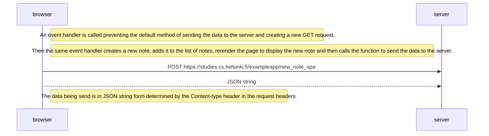

```mermaid
sequenceDiagram
    participant browser
    participant server

    Note right of browser: An event handler is called preventing the default method of sending the data to the server and creating a new GET request.
    Note right of browser: Then the same event handler creates a new note, adds it to the list of notes, rerender the page to display the new note and then calls the function to send the data to the server.

    browser->>server: POST https://studies.cs.helsinki.fi/exampleapp/new_note_spa
    browser-->>server: JSON string

    Note right of browser: The data being send is in JSON string form determined by the Content-type header in the request headers.

```
